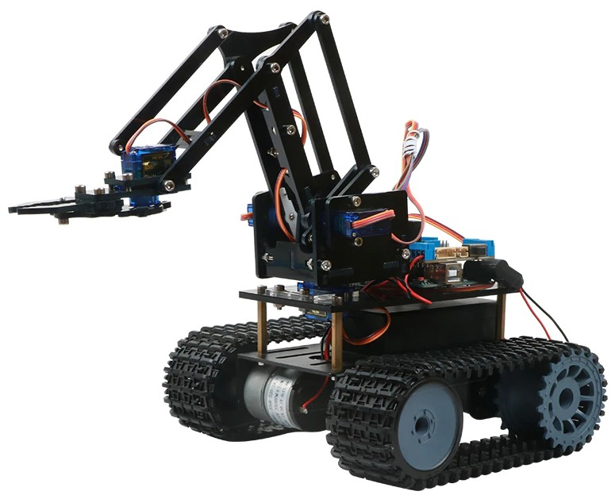
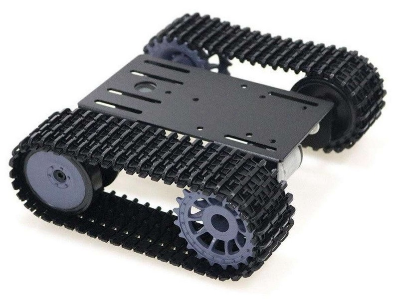
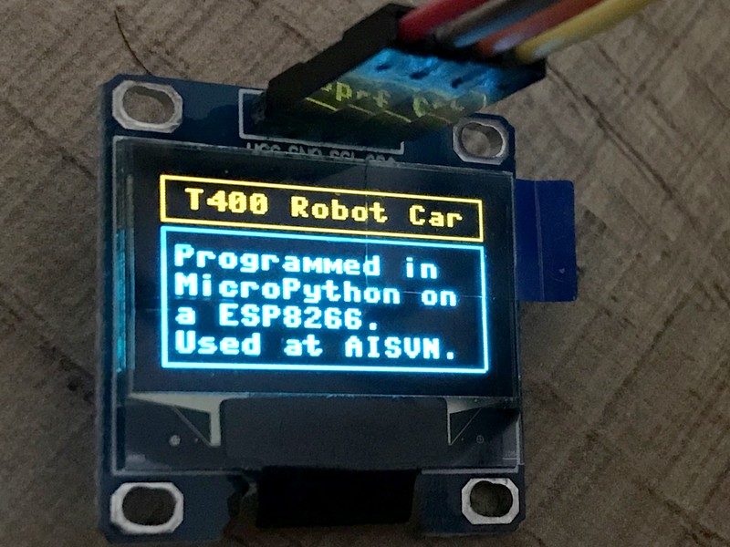

# T400

[](https://travis-ci.com/kreier/T400)
[](http://opensource.org/licenses/MIT)
[](http://hits.dwyl.io/kreier/T400)

Robot car with WiFi, programmed and controlled by MicroPython. The OLED screen gives information about status, connection and WiFi network to connect to (AP mode).




## Project

This car was build during ASA session III in 2019/2020 at the AISVN. In 11 weeks from February 24th to May 22nd we successfully created 8 robot cars. Here are some pictures of the finished products:



### Key features

Over the time of 3 months the students will reach different stages of their project, but here are some key features:

- Central unit is a ESP8266 with 32 kByte RAM and 4 GByte Flash memory, running at 160 MHz.
- The programming language is [MicroPython](https://en.wikipedia.org/wiki/MicroPython) with an interactive prompt [REPL](https://en.wikipedia.org/wiki/Read%E2%80%93eval%E2%80%93print_loop).
- The control unit is powered by a standard 5V powerbank.
- The drive unit is a caterpillar base with two 12V motors.
- The robot car can be controlled via WiFi.
- An OLED display 128x64 (ssd1306) gives status updates.

## Materials

The materials used for this project were ordered at [IC ĐÂY RỒI](https://icdayroi.com/), [thegioiic.com](https://thegioiic.com/) and [lazada.vn](https://www.lazada.vn/#). Here is a list of materials:

| Nr | Name        | Amount | Unit Price |   Sum   |    Supplier    |
|:--:|-------------|:------:|-----------:|--------:|:--------------:|
|  1 |ESP8266 NodeMCU | 1     | 83000 VND| 83000 VND| [link thegioiic](https://thegioiic.com/products/lua-esp8266-cp2102-nodemcu-wifi-module) |
| 2 |Motor Shield L293D | 1 | 30000 VND| 30000 VND| [link thegioiic](https://thegioiic.com/products/esp12e-lua-l293d-de-ra-chan-wifi-esp8266-nodemcu) |
| 3 |OLED display 126x64 I2C | 1 | 79000 VND| 79000 VND| [link thegioiic](https://thegioiic.com/products/lcd-oled-0-96inch-128x64-iic-4pin-chu-trang) |
| 4 |Wires DuPont MF and FF | 20 |   300 VND| 6000 VND| [link thegioiic](https://thegioiic.com/products/day-be-cai-cai-dai-15cm) |
| 5 |Robot caterpillar 12V unit | 1 | 483000 VND| 483000 VND| [link lazada.vn](https://www.lazada.vn/products/smart-tank-car-chassis-tracked-caterpillar-crawler-robot-platform-with-dual-dc-12v-motor-for-diy-for-arduino-t101-ptp101-i402162026-s693860633.html?spm=a2o4n.searchlist.list.162.24b0381feoC1Mg&search=1) |
| 6 |Powerbank 10000 mAh 2 USB | 1 | 249000 VND| 249000 VND| [link nguyenkim](https://www.nguyenkim.com/pin-sac-du-phong-mili-power-shine-ii-hb-m90bk.html) |
| 7 |DC step-up converter 5V 12V | 1 | 23000 VND| 23000 VND| [link thegioiic](https://thegioiic.com/products/xl6009-mach-tang-ap-4a) |
| 8 |Robot 4DOF kit | 1 | 246000 VND| 246000 VND| [link lazada.vn](https://www.lazada.vn/products/4-dof-acrylic-chua-lap-rap-diy-canh-tay-robot-diy-bo-cho-arduino-may-lam-ho-tro-hoc-tap-sg90-servo-i267650656-s391094259.html) |
| 9 |Servo SG90 | 5 | 29000 VND| 145000 VND| [link icdayroi](https://icdayroi.com/servo-sg90) |
| 10 |Ultrasonic Module US-100 3.3V | 1 | 59000 VND| 59000 VND| [link thegioiic](https://thegioiic.com/products/us-100-module-cam-bien-sieu-am) |
| 11 |I2C servo controller PCA9685 | 1 | 49000 VND| 49000 VND| [link thegioiic](https://thegioiic.com/products/pca9685-dieu-khien-dong-co-servo-12bit-pwm-6-kenh) |
| 12 |USB male connector Type A | 2 | 1800 VND| 3600 VND| [link thegioiic](https://thegioiic.com/products/cong-usb2-0-typea-4pin-dau-duc-han-day) |
| 13 |Buzzer 3.3 Volt | 1 | 3000 VND| 3000 VND| [link thegioiic](https://thegioiic.com/products/module-coi-buzzer-3-3v-5v) |
| 14 |Screw M3 8mm | 8 | 550 VND| 4400 VND| [link thegioiic](https://thegioiic.com/products/vit-pm-m3-x-8mm) |
| 15 |HEX-M3 spacer 15mm | 4 | 1000 VND| 4000 VND| [link thegioiic](https://thegioiic.com/products/tru-dong-hex-m3-cai-cai-dai-15mm) |
|  | |  |  VND| 1467000 VND|  |

## Code

This is an example of the MicroPython code we are going to use:

``` py
from machine import Pin, I2C
import ssd1306

# ESP32 Pin assignment 
i2c = I2C(1, scl=Pin(22), sda=Pin(21))

oled_width = 128
oled_height = 64
oled = ssd1306.SSD1306_I2C(oled_width, oled_height, i2c)

# draw some boxes

for x in range(0, 127): # horizontal lines
  oled.pixel(x, 0, 1)
  oled.pixel(x, 15, 1)
  oled.pixel(x, 16, 1)
  oled.pixel(x, 63, 1)
  
for y in range(0, 63): # vertical lines
  oled.pixel(0, y, 1)
  oled.pixel(127, y, 1)

oled.text('T400 Robot Car', 8, 4)
oled.text('Programmed in', 4, 22)
oled.text('MicroPython on', 4, 32)
oled.text('a ESP8266.', 4, 42)
oled.text('Used at AISVN.', 4, 52)
  
oled.show()
```
