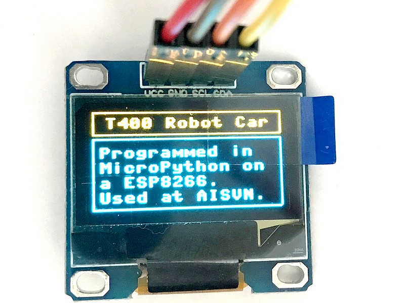

# T400

[](https://travis-ci.com/kreier/T400)
[](http://opensource.org/licenses/MIT)
[](http://hits.dwyl.io/kreier/T400)

Robot car with WiFi, programmed and controlled by MicroPython. The OLED screen gives information about status, connection and WiFi network to connect to (AP mode).


## Project

This car was build during ASA session 3 in 2019/2020 at the AISVN. Here are some pictures of the finished products:



### Key features

Over the time of 3 months the students will reach different stages of their project, but here are some key featuresL

- Central unit is a ESP8266 with 32 kByte RAM and 4 GByte Flash memory, running at 160 MHz
- The programming language is [MicroPython](https://en.wikipedia.org/wiki/MicroPython) with an interactive prompt [REPL](https://en.wikipedia.org/wiki/Read%E2%80%93eval%E2%80%93print_loop).
- The control unit is powered by a standard 5V powerbank
- The drive unit is a caterpillar base with two 12V motors
- The robot car can be controlled via WiFi
- An OLED display 128x64 (ssd1306) gives status updates

## Materials

The materials used for this project were ordered by [ICDAYROI](https://icdayroi.com/), [THEGIOIIC](https://thegioiic.com/) and [Lazada](https://www.lazada.vn/#). Here is a list of materials:

<table>
<thead><tr><th>nr</th>
<th>name</th>
<th>amount</th>
<th>unit price</th>
<th>price</th>
<th>link</th>
</tr></thead>
<tbody><tr>
<td align="right">1</td>
<td>Arduino Leonardo</td>
<td align="center">1</td>
<td align="right">125.000 VND</td>
<td align="right">125.000 VND</td>
<td><a href="https://icdayroi.com/arduino-leonardo-r3">link icdayroi.com</a></td>
</tr>
<tr>
<td align="right">2</td>
<td>Robot base 4 wheels</td>
<td align="center">1</td>
<td align="right">140.000 VND</td>
<td align="right">140.000 VND</td>
<td><a href="https://icdayroi.com/khung-xe-robot-4-banh">link icdayroi.com</a></td>
</tr>
<tr>
<td align="right">3</td>
<td>Motor Shield L298</td>
<td align="center">1</td>
<td align="right">120.000 VND</td>
<td align="right">120.000 VND</td>
<td><a href="https://icdayroi.com/arduino-motor-shield-l298">link icdayroi.com</a></td>
</tr>
<tr>
<td align="right">4</td>
<td>Bluetooth AT-09</td>
<td align="center">1</td>
<td align="right">75.000 VND</td>
<td align="right">75.000 VND</td>
<td><a href="https://icdayroi.com/mach-thu-phat-bluetooth-4-0-uart-cc2541-at-09">link icdayroi.com</a></td>
</tr>
<tr>
<td align="right">5</td>
<td>Battery 18650 3.7V</td>
<td align="center">2</td>
<td align="right">35.000 VND</td>
<td align="right">70.000 VND</td>
<td><a href="https://icdayroi.com/pin-cell-18650-4200mah-3-7v">link icdayroi.com</a></td>
</tr>
<tr>
<td align="right">6</td>
<td>Battery holder 2C 18650</td>
<td align="center">1</td>
<td align="right">7.000 VND</td>
<td align="right">7.000 VND</td>
<td><a href="https://icdayroi.com/hop-de-pin-18650-loai-2-cell">link icdayroi.com</a></td>
</tr>
<tr>
<td align="right">7</td>
<td>Power switch MTS 102</td>
<td align="center">1</td>
<td align="right">4.000 VND</td>
<td align="right">4.000 VND</td>
<td><a href="https://icdayroi.com/cong-tac-mts-102">link icdayroi.com</a></td>
</tr>
<tr>
<td align="right">8</td>
<td>Battery voltage display</td>
<td align="center">1</td>
<td align="right">22.000 VND</td>
<td align="right">22.000 VND</td>
<td><a href="https://icdayroi.com/dong-ho-do-von-volt-3-5-30v">link icdayroi.com</a></td>
</tr>
<tr>
<td align="right">9</td>
<td>Servo SG90</td>
<td align="center">5</td>
<td align="right">29.000 VND</td>
<td align="right">145.000 VND</td>
<td><a href="https://icdayroi.com/servo-sg90">link icdayroi.com</a></td>
</tr>
<tr>
<td align="right">10</td>
<td>Ultrasonic module HC-SR04</td>
<td align="center">1</td>
<td align="right">20.000 VND</td>
<td align="right">20.000 VND</td>
<td><a href="https://icdayroi.com/cam-bien-sieu-am-hc-sr04">link icdayroi.com</a></td>
</tr>
<tr>
<td align="right">11</td>
<td>Robot 4DOF kit</td>
<td align="center">1</td>
<td align="right">246.000 VND</td>
<td align="right">246.000 VND</td>
<td><a href="https://www.lazada.vn/products/4-dof-acrylic-chua-lap-rap-diy-canh-tay-robot-diy-bo-cho-arduino-may-lam-ho-tro-hoc-tap-sg90-servo-i267650656-s391094259.html?spm=a2o4n.searchlist.list.3.1b121f13xg7z7G&amp;search=1">link lazada.vn</a></td>
</tr>
<tr>
<td align="right">12</td>
<td>Wires DuPont MF and FF</td>
<td align="center">20</td>
<td align="right">300 VND</td>
<td align="right">6.000 VND</td>
<td><a href="https://thegioiic.com/products/day-be-cai-cai-dai-15cm">link thegioiic.com</a></td>
</tr>
<tr>
<td align="right">13</td>
<td>Voltmeter for Battery</td>
<td align="center">1</td>
<td align="right">21.000 VND</td>
<td align="right">21.000 VND</td>
<td><a href="https://thegioiic.com/products/dong-ho-do-ap-dc-2-5-30vdc">link thegioiic.com</a></td>
</tr>
<tr>
<td align="right">14</td>
<td>Display 1602 3.3V white on blue</td>
<td align="center">1</td>
<td align="right">32.000 VND</td>
<td align="right">32.000 VND</td>
<td><a href="https://thegioiic.com/products/lcd-1602-nen-xanh-duong-chu-trang-3-3v">link thegioiic.com</a></td>
</tr>
<tr>
<td align="right">15</td>
<td>I2C serial to parallel adapter</td>
<td align="center">1</td>
<td align="right">13.500 VND</td>
<td align="right">13.500 VND</td>
<td><a href="https://thegioiic.com/products/mach-giao-tiep-lcd-ky-tu-sang-i2c">link thegioiic.com</a></td>
</tr>
<tr>
<td align="right"></td>
<td> </td>
<td align="center"></td>
<td> </td>
<td align="right">1.046.500 VND</td>
<td> </td>
</tr>
</tbody></table>

## Code

This is an example of the MicroPython code we are going to use:

``` py
from machine import Pin, I2C
import ssd1306

# ESP32 Pin assignment 
i2c = I2C(1, scl=Pin(22), sda=Pin(21))

oled_width = 128
oled_height = 64
oled = ssd1306.SSD1306_I2C(oled_width, oled_height, i2c)

# draw some boxes

for x in range(0, 127): # horizontal lines
  oled.pixel(x, 0, 1)
  oled.pixel(x, 15, 1)
  oled.pixel(x, 16, 1)
  oled.pixel(x, 63, 1)
  
for y in range(0, 63): # vertical lines
  oled.pixel(0, y, 1)
  oled.pixel(127, y, 1)

oled.text('T400 Robot Car', 8, 4)
oled.text('Programmed in', 4, 22)
oled.text('MicroPython on', 4, 32)
oled.text('a ESP8266.', 4, 42)
oled.text('Used at AISVN.', 4, 52)
  
oled.show()
```
