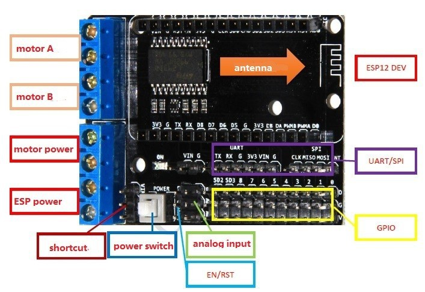

# Programming in C with the Arduino IDE

As a parallel development we have some code for the esp8266 on the motorshield board written in C. It helps troubleshooting behaviour and usability of pins, combinations etc.

The board uses the pin D1 to D4 to control tle L293DD motor bridge. The I2C is usually booked on these pins, they have to be remapped therefore.

## I2C Display 1602

It works only with D5 and D6. D7 and D8 throw errors when unconnected to a I2C bus and stop the program when connected. Same is for SD2 and SD3 (GPIO9 and GPIO10). Connection is

| PIN | GPIO | I2C |
|-----|------|-----|
| D6  | 12   | SDA |
| D5  | 14   | SCL |

``` c
#include <LiquidCrystal_I2C.h>
#include <Wire.h>

LiquidCrystal_I2C lcd(0x27, 16, 2);

void setup(){        // usually I2C on D1 and D2, but used for motor driver
  Wire.begin(12,14); // I2C on D6/GPIO12/SDA and D5/GPIO14/SCL
  lcd.init();
  lcd.backlight();
  pinMode(16, OUTPUT);
}

void loop(){
  for(int i = 0; i < 2; i++){
    lcd.setCursor(0, i);
    lcd.print("Hello, World!");
    digitalWrite(16, i);
    delay(500);
    lcd.clear();
  }
}
```

