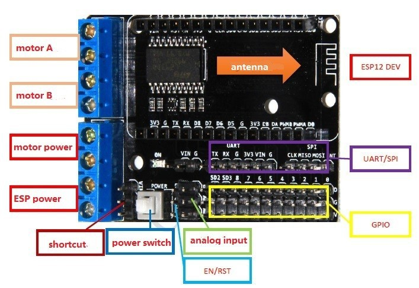
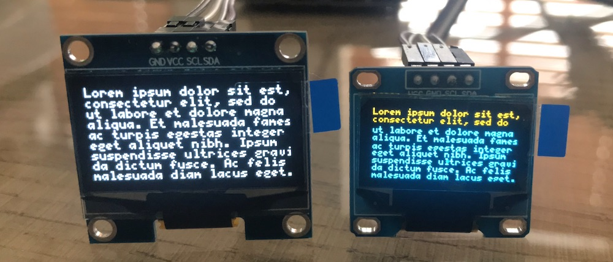

# Programming in C with the Arduino IDE

As a parallel development we have some code for the esp8266 on the motorshield board written in C. It helps troubleshooting behaviour and usability of pins, combinations etc.

The board uses the pin D1 to D4 to control tle L293DD motor bridge. The I2C is usually booked on these pins, they have to be remapped therefore.

## I2C Display 1602

It works only with D5 and D6. D7 and D8 throw errors when unconnected to a I2C bus and stop the program when connected. Same is for SD2 and SD3 (GPIO9 and GPIO10). Connection is

| PIN | GPIO | I2C |
|-----|------|-----|
| D6  | 12   | SDA |
| D5  | 14   | SCL |

``` c
#include <LiquidCrystal_I2C.h>
#include <Wire.h>

LiquidCrystal_I2C lcd(0x27, 16, 2);

void setup(){        // usually I2C on D1 and D2, but used for motor driver
  Wire.begin(12,14); // I2C on D6/GPIO12/SDA and D5/GPIO14/SCL
  lcd.init();
  lcd.backlight();
  pinMode(16, OUTPUT);
}

void loop(){
  for(int i = 0; i < 2; i++){
    lcd.setCursor(0, i);
    lcd.print("Hello, World!");
    digitalWrite(16, i);
    delay(500);
    lcd.clear();
  }
}
```


## Remote controlled robot

A great project has been done by [Vincent Lacour](https://github.com/lacour-vincent) to create a remote controlled robot car with an ESP8266. He wrote an app to control the robot using WiFi, let's later update the code to directly control the robot in a browser.

Link to his project (November 2019):

- Code https://github.com/lacour-vincent/wifi-car-esp8266
- Android app: https://play.google.com/store/apps/details?id=com.lacour.vincent.wificaresp8266
- iOS app: not yet there


Other notable projects:

With Remoteme: https://www.hackster.io/WolfxPac/wifi-controlled-robot-using-esp8266-8756b7 2019/01/01

With Blynk: https://www.instructables.com/id/Wifi-Controlled-Robot-Car-Using-Nodemcu-and-Blynk/ 2019/07/05

Simple https://www.hackster.io/alankrantas/simple-nodemcu-wifi-controlled-car-esp8266-c5491e 2019/08/19

## OLED display at I2C

For slightly more money one can get an OLED display for the I2C bus, which has a better resolution than the 1602 display, supports graphics and is smaller in size - perfect for a small robot. To deceide if I should go for 0.96" or 1.3" I ordered both and compared the output of both displays, since both have the same resolution:



Clearly the larger SH1106 display is to prefer compared to the smaller SSD1306 variant in two colors.
