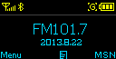
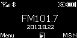
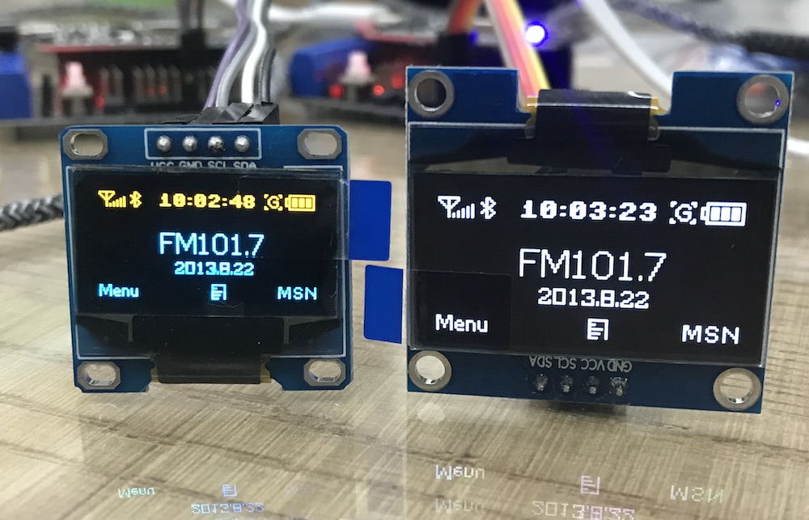

# Text and graphics on 128x64 OLED i2c display

We use pin D5 (GPIO14) as SDA and D6 (GPIO12) as SCL for the i2c bus. The driver library 1306.py should be installed on the device. You can show any image 128x64 monochrome image. For example:

 

The code used is [splash3.py](splash3.py).

## Size 0.96 inch or 1.3 inch

For comparison I ordered the slightly larger display with 1.3 inch as well. It needs the different sh1106 driver, but has the same functions as the ssd1306. Text is easier to read. Here an image:



## Convert images

I use the online [tool from majer.ch](http://www.majer.ch/lcd/adf_bitmap.php) and convert the code from ', 0x87' to '\x87' in the bytearray. Follow this instructions:

To create an image there is a description at [the micropython forum](https://forum.micropython.org/viewtopic.php?t=2974). In short deshipu says:

The buffer in the previous exampe is created by scanning the original image pixel-by-pixel and setting the bits of the bytes depending on whether they are supposed to be on or off. The alignment of the bytes is as follows (example of a 16x16 image, the digits signify the bits of each byte):

```
a7 b7 c7 d7 e7 f7 g7 h7 i7 j7 k7 l7 m7 n7 o7 p7
a6 b6 c6 d6 e6 f6 g6 h6 i6 j6 k6 l6 m6 n6 o6 p6
a5 b5 c5 d5 e5 f5 g5 h5 i5 j5 k5 l5 m5 n5 o5 p5
a4 b4 c4 d4 e4 f4 g4 h4 i4 j4 k4 l4 m4 n4 o4 p4
a3 b3 c3 d3 e3 f3 g3 h3 i3 j3 k3 l3 m3 n3 o3 p3
a2 b2 c2 d2 e2 f2 g2 h2 i2 j2 k2 l2 m2 n2 o2 p2
a1 b1 c1 d1 e1 f1 g1 h1 i1 j1 k1 l1 m1 n1 o1 p1
a0 b0 c0 d0 e0 f0 g0 h0 i0 j0 k0 l0 m0 n0 o0 p0
q7 r7 s7 t7 u7 v7 w7 x7 y7 z7 A7 B7 C7 D7 E7 F7
q6 r6 s6 t6 u6 v6 w6 x6 y6 z6 A6 B6 C6 D6 E6 F6
q5 r5 s5 t5 u5 v5 w5 x5 y5 z5 A5 B5 C5 D5 E5 F5
q4 r4 s4 t4 u4 v4 w4 x4 y4 z4 A4 B4 C4 D4 E4 F4
q3 r3 s3 t3 u3 v3 w3 x3 y3 z3 A3 B3 C3 D3 E3 F3
q2 r2 s2 t2 u2 v2 w2 x2 y2 z2 A2 B2 C2 D2 E2 F2
q1 r1 s1 t1 u1 v1 w1 x1 y1 z1 A1 B1 C1 D1 E1 F1
q0 r0 s0 t0 u0 v0 w0 x0 y0 z0 A0 B0 C0 D0 E0 F0
```

I used the following code to generate it:


``` py
import pygame

image = pygame.image.load("1bit-logo.png")
buffer = bytearray((image.get_height() // 8) * image.get_width())
i = 0
for y in range(image.get_height() // 8):
    for x in range(image.get_width()):
        byte = 0
        for bit in range(8):
            pixel = image.get_at((x, y * 8 + bit))
            if pixel[0] != 255:
                byte |= (1 << bit)
        buffer[i] = byte
        i += 1
print(repr(buffer))
```

After that _kamikaze_ added: `or you could use ImageMagick's convert and store it in file to save RAM`

