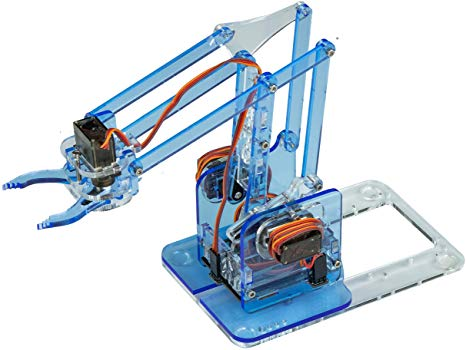
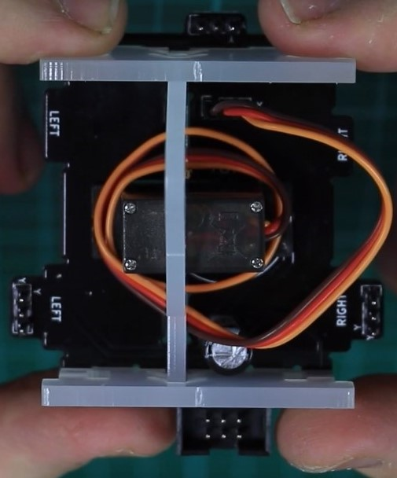

# Robot arm at T400

Limited time and resources led to the decision to use the MeArm v3.0 for our T400 project during ASA3. The assembly should take 25 minutes and can be followed [in this video](https://youtu.be/sPdbs9b5udQ).

The files are located in this folder and sourced from [here](https://www.thingiverse.com/thing:3420797/files) and [here](https://github.com/mimeindustries/MeArm). The modification is the removal of the text for the lasercutting and shortend of some corners to fit on the base of the robot.

## PCB

The files for the PCB are not provided, so they have to be recreated. This file should serve as inspiration, the rations are all given in the dxf file or can be measured there:

## Additional materials

Aside from the laser cut 3mm acrylic we need some M2.5 screws, no nuts! That's said [here in the video](https://youtu.be/sPdbs9b5udQ?t=455). So I count:

- 16x - M2.5 x 6mm
- 18x - M2.5 x 10mm
- 2x  - M2.5 x 16mm

I'll give it a try on January 31st, 2020.

## Licence

User phenoptix (Ben Gray from Nottingham) from Mime industries/MeArm published the following information on his website regarding the licence:

The hardware is released under [Creative Commons Share-alike 3.0](https://creativecommons.org/licenses/by-sa/3.0/).

All other code is open source so please feel free to do anything you want with it; you buy me a beer if you use this and we meet someday (Beerware license). Also this boiler plate is yoinked from Sparkfun with thanks. Images are CC-SA-NC soz, have the files and design but take your own pics ;)

