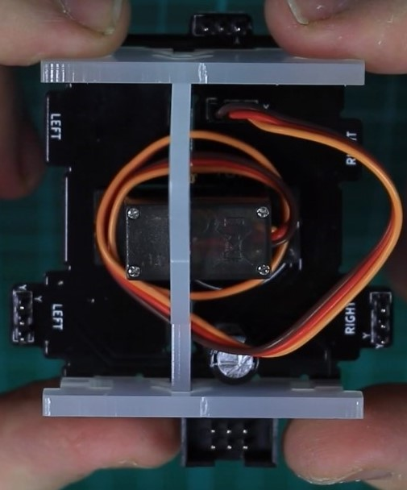

# PCB for MeArm3

The MeArm 3.0 uses a custom PCB to connect the 4 servos to a single flat cable with 6 pins and provide a physical base plate for the ground servo at the same time.

From the assemble video you can guess the shape:

Since the shematics is not provided, it has to be recreated in EAGLE. Here my attempts: 

The files are located in this folder and sourced from [here](https://www.thingiverse.com/thing:3420797/files) and [here](https://github.com/mimeindustries/MeArm). The modification is the removal of the text for the lasercutting and shortend of some corners to fit on the base of the robot.

## PCB

The files for the PCB are not provided, so they have to be recreated. This file should serve as inspiration, the rations are all given in the dxf file or can be measured there:

## Additional materials

Aside from the laser cut 3mm acrylic we need some M2.5 screws, no nuts! That's said [here in the video](https://youtu.be/sPdbs9b5udQ?t=455). So I count:
