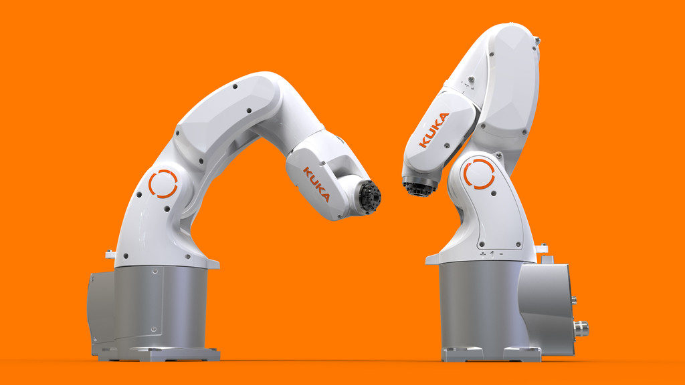

# Robotarm

The T400 should be equipped with a robot arm. Due to financial constrains we are going to use a $11 (246,000 VND) lasercut acryl 4 DOF arm with SG50 servos. The final robot should look like this:

## 3D printed robot arm - EEZYbotARM MK1 and MK2

In 2015 and italian maker designed a printable [robot arm MK1](https://www.thingiverse.com/thing:1015238) and soon found it to small. Still the project was successfull and downloaded more than 120,000 times. So he created the very [successfull MK2](https://www.thingiverse.com/thing:1454048). It is downloaded at [thingiverse](https://thingiverse.vom) some You can get it printed in HCMC for example at [makerstore.vn](http://makerstore.vn) for 281,00 VND (MK1) or 525,000 VND (MK2). They have the screws and servos as well.

## Robot arm 6 DOF from China

At Aliexpress you can order the metal materials for a 6 DOF robot arm for $25. Equipped with 1Nm digital servos like MG996R the product is rather versatile. See it here in action:

`2020/01/12` The kit was just ordered. And we need the servos ...

## Design a robot arm ourselves

Inspired by the relative stability of the digital servo driven robot arm and the design of the KUKA KR 3 AGILUS.

