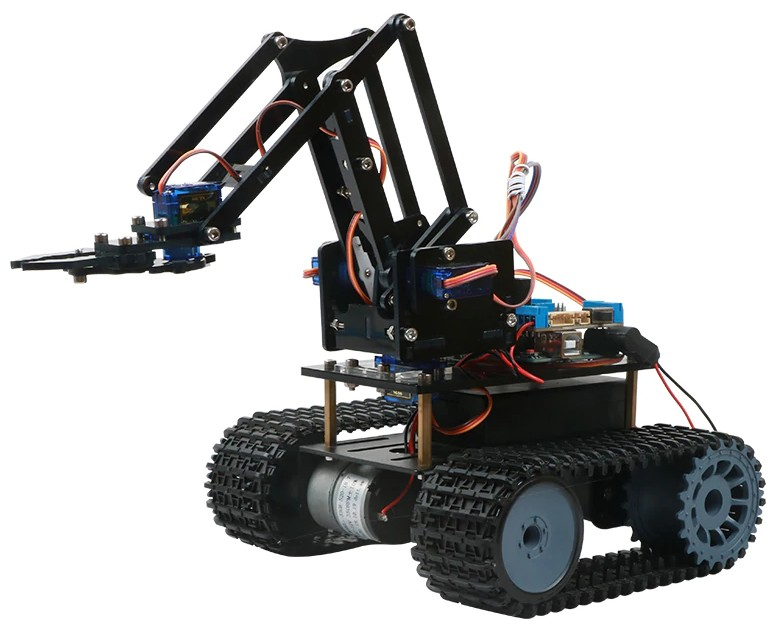
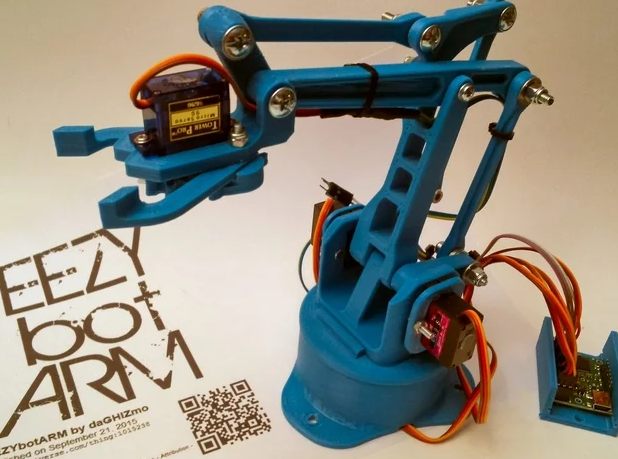
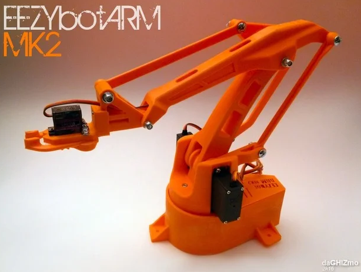
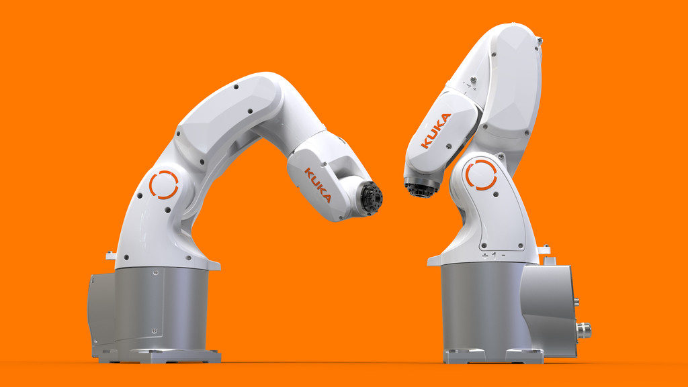
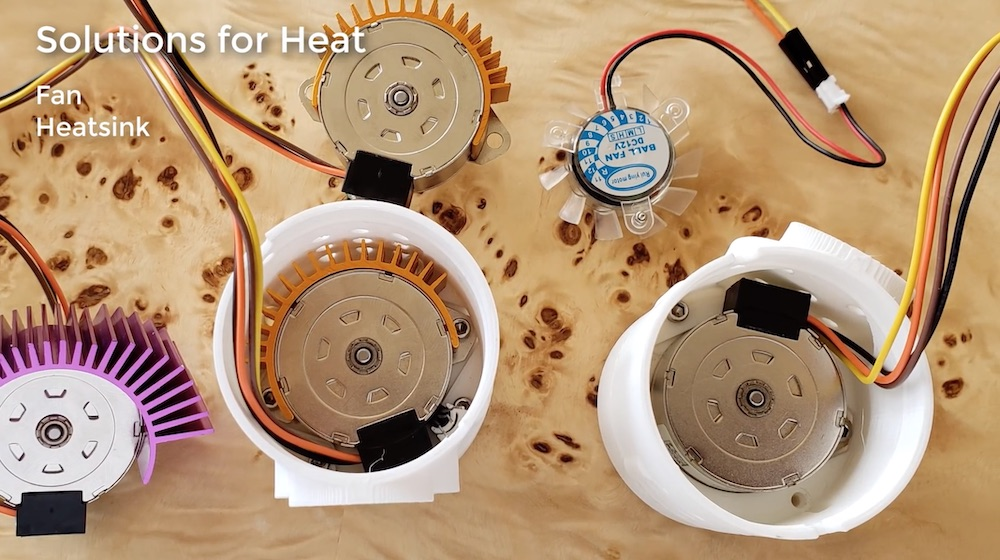
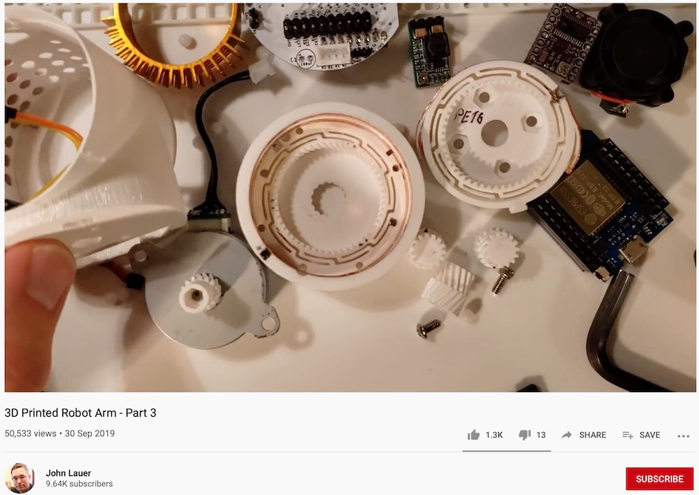
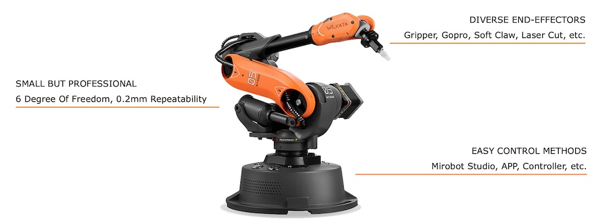
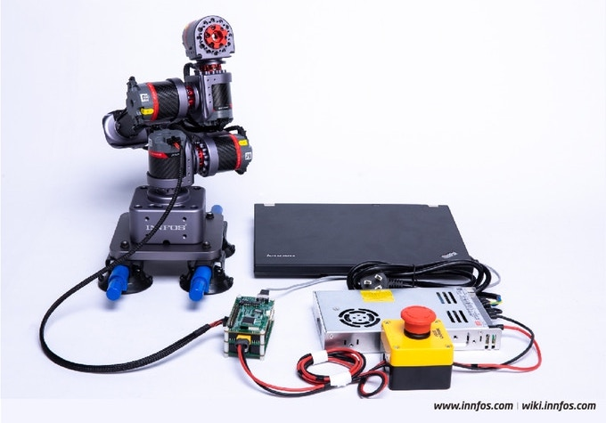
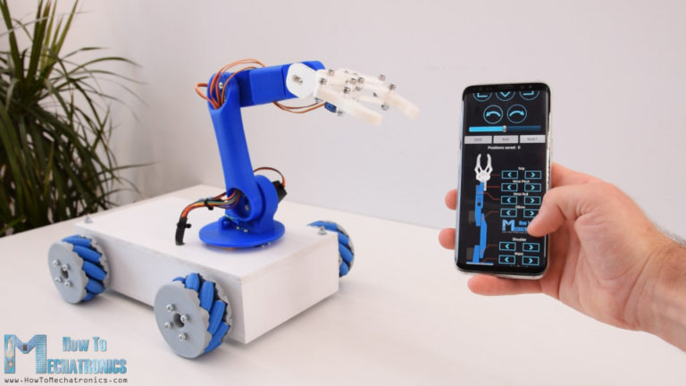

# Robotarm

> [Link to robot arm for T400](MeArm/README.md)

The T400 should be equipped with a robot arm. Due to financial constrains we are going to use a $11 (246,000 VND) lasercut acryl 4 DOF arm with SG50 servos. The final robot should look like this:

## 3D printed robot arm - EEZYbotARM MK1 and MK2

In 2015 and italian maker designed a printable [robot arm MK1](https://www.thingiverse.com/thing:1015238). It was very successfull and downloaded more than 120,000 times.

Soon he found it to be too small and [created the MK2](https://www.thingiverse.com/thing:1454048) in 2016. It is downloaded at [thingiverse](https://thingiverse.vom) some 110,000 times. You can get it printed in HCMC for example at [makerstore.vn](http://makerstore.vn) for 281,00 VND (MK1) or 525,000 VND (MK2). They have the screws and servos as well.

## Robot arm 6 DOF from China

At Aliexpress you can order the metal materials for a 6 DOF robot arm for $25. Equipped with 1Nm digital servos like MG996R the product is rather versatile. See it here in action:

`2020/01/12` The kit was just ordered. And we need the servos ...

## Design a robot arm ourselves

Inspired by the relative stability of the digital servo driven robot arm and the design of the KUKA KR 3 AGILUS.

## Stepper motors

One design with stepper motors is the [WE-R2.4 robot](https://www.thingiverse.com/thing:3327968) that was published in January 2019 by [LoboCNC](https://www.thingiverse.com/LoboCNC/about). Another user [John Lauer](https://github.com/chilipeppr) from [Chilipeppr](http://chilipeppr.com/arm) tried to build this arm and published a [first video](https://www.youtube.com/watch?v=tEbJV32GyYU) in February 2019. [Part 2](https://www.youtube.com/watch?v=RdmdFIhCo4M) from March 2019 had the controller software and hardware based on the ESP32 finishd. But there are several problems:

- Heat
- Homing
- Backlash
- Wiring
- Jogging
- Training

By September 2019 these where addressed and resolved or improved. See [Part 3 video](https://www.youtube.com/watch?v=4o3d7_WZ_DQ). Couldn't find a number for the produced torque or maximum rpm, though.

## Mirobot - successful Kickstarter from September 2019, starting $295

Project [on Kickstarter](https://www.kickstarter.com/projects/mirobot/mirobot-6-axis-mini-industrial-robot-arm/description). Shipping started January 2020. Got more than $300.000. Later on [Indogogo](https://www.indiegogo.com/projects/mirobot-6-axis-desktop-robot-arm#/) as well. This is how it looks:

## GLUON by INNFOS - suspended on kickstarter

What [a promising project](https://www.kickstarter.com/projects/1383636492/the-smallest-servomotor-robotic-arm)! Fast and silent brushless actuators for $99 each (SCA QDD Lite-NE30-36) or an entire 4DOF for $519 or 6DOF robot arm for $899. But there might be some tentions with the investors, after funding from 612 backers for $519.848 in November 2019 (success in 30 seconds) the project was suspended by kickstarter in 2020. [Link to video](https://www.youtube.com/watch?v=-xzvWhRDGDU). Looked like this:

## How to Mechatronics - back to simpler parts

While investigating I found another project that shares a lot of files and information and has a simple robot arm design with servos. It is [this project on howtomechatronics.com](https://howtomechatronics.com/projects/arduino-robot-arm-and-mecanum-wheels-platform-automatic-operation/) from [Dejan](https://howtomechatronics.com/author/howtom12_wp/). He made [a video about his project](https://youtu.be/LBNRGBY5zN8).

He even created a Android App with MIT App invenbor to control his robot. We might use this for our T400. We don't have the stepper motors for our base as he does, but we might modifiy our code to fit the esp8266 instead of a Arduino Mega.
